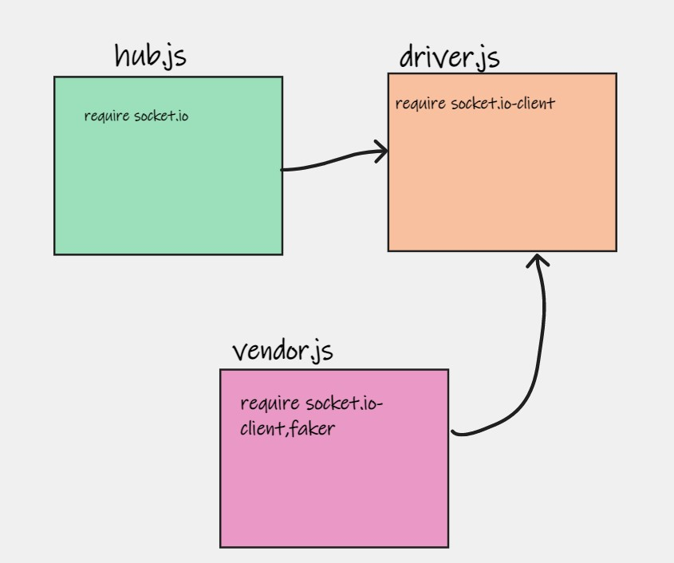
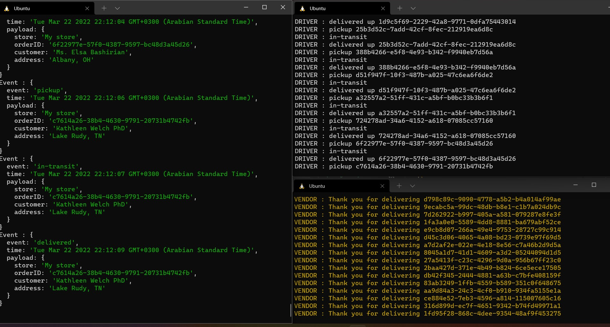

# caps-Socket.io
caps-Socket.io

## UML

## Getting Started

- add a actions to active CI/CD .
- install packages (socket.io, socket.io-client ,faker ,@faker-js/faker)
- to test the code run 'npm test'
- use node hub.js to start the Event .
- use node driver.js to start the Driver .
- use node vendor.js to start the Vendor .
- [PR](https://github.com/ManalKhAlbahar/caps-Socket.io/pull/1).
- [Github actions](https://github.com/ManalKhAlbahar/caps-Socket.io/actions).

## Terminals Oitput

